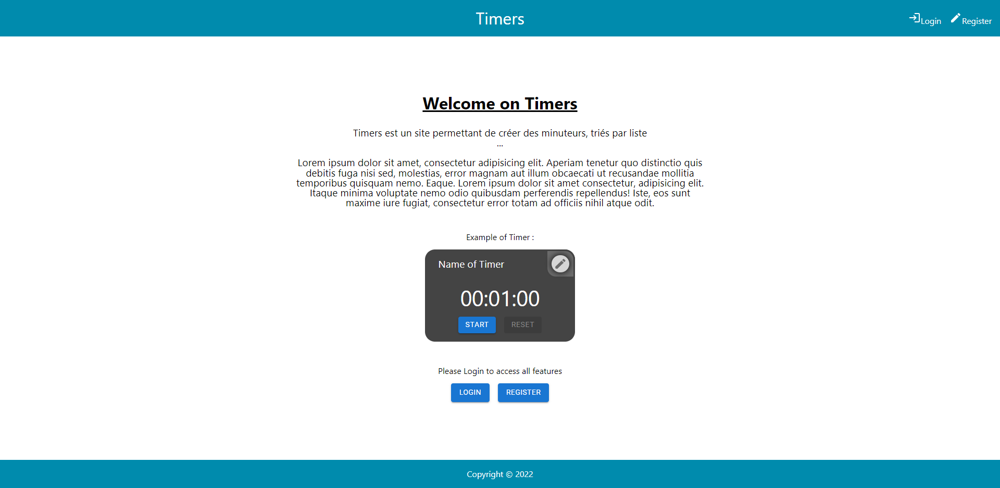
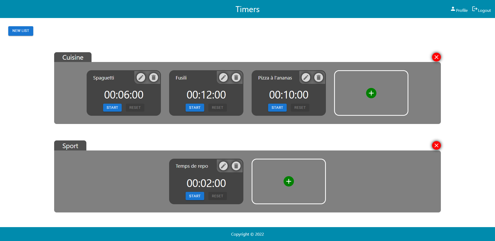
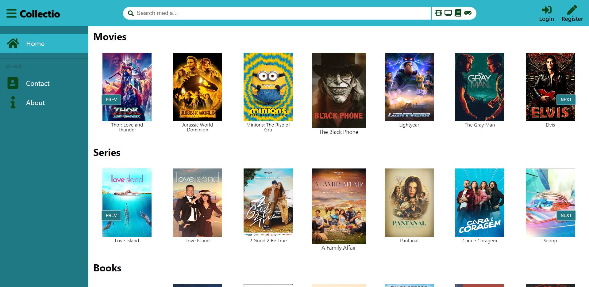

<h1>Bonjour à tous 👋</h1>

  Je suis développeur FullStack Javascript à la recherche d'un poste afin d'approfondir et mettre au service d'une entreprise mes compétences de développeur.

<h2 style="text-decoration: underline">Voici les technologies que j'utilise :</h2>

  
  
  
  
  
  
  
  
  
  
   
  
  
  
  
  
  

<h2 style="text-decoration: underline">Mes projets :</h2>
<ul style="margin-bottom: 2em">
  <li>
    <h3><a style="color: inherit" href="https://online-timers.netlify.app" target="_blank">Timers</a> (👈 disponible en cliquant ici) :</h3>
    
Du 4 Juin au 5 Octobre 2022

    
Il s'agit d'un projet personnel que j'ai commencé après la formation.

    

      
En savoir plus...

       
      

        Timers est un site permettant de créer des minuteurs, triés par liste.
      

      <a style="color: inherit" href="https://github.com/LeoChenot/timer-front" target="_blank">
        Repo Front-End
      </a>
      <a style="color: inherit" href="https://github.com/LeoChenot/timer-back" target="_blank">
        Repo Back-End
      </a>
      <h4>Technologies utilisées :</h4>
      

        

          <h5 style="margin-top: 0">Front</h5>
          <ul>
            <li>React</li>
            <li>Redux</li>
            <li>Sass</li>
            <li>Axios</li>
          </ul>
        

        

          <h5 style="margin-top: 0">Back</h5>
          <ul>
            <li>NodeJS</li>
            <li>ExpressJS</li>
            <li>PostgreSQL</li>
            <li>JSON Web Tokens</li>
            <li>BCrypt</li>
          </ul>
        

      

      
      
    

  </li>
  <li>
    <h3><a style="color: inherit" href="https://collectio-copy.netlify.app" target="_blank">Collectio</a> (👈 disponible en cliquant ici) :</h3>
    
Du 27 Avril 2022 au 27 Mai 2022

    
Il s'agit du projet de fin d'étude que j'ai réalisé avec 3 camarades durant 1 mois.

    

      
En savoir plus...

       
      

        Le but de Collectio est de permettre à ses utilisateurs de rechercher des œuvres d’horizons variés (films, séries, livres, jeux vidéos...), d'accéder à leurs informations à partir d’API existantes, de se constituer une multithèque (qu’on appellera Collection), et d’y accéder dans un unique espace au visuel moderne, rappelant une bibliothèque ou vidéothèque physique.
      

      

        Cet espace dédié sera une vitrine des différentes passions et intérêts de nos utilisateurs sur
        une seule et même plateforme, à l’inverse de la plupart des grands sites communautaires
        qui se spécialisent autour d’un unique média.
      

      <a style="color: inherit" href="https://github.com/LeoChenot/projet-7-multitheque-front-copy" target="_blank">
        Repo Front-End
      </a>
      <h4>Technologies utilisées :</h4>
      

        

          <h5 style="margin-top: 0">Front</h5>
          <ul>
            <li>React</li>
            <li>Redux</li>
            <li>Sass</li>
            <li>Axios</li>
            <li>React-icons</li>
            <li>GlideJS</li>
          </ul>
        

        

          <h5 style="margin-top: 0">Back</h5>
          <ul>
            <li>NodeJS</li>
            <li>ExpressJS</li>
            <li>PostgreSQL</li>
            <li>Axios</li>
            <li>JSON Web Tokens</li>
            <li>Redis</li>
            <li>Sqitch</li>
            <li>BCrypt</li>
            <li>Faker</li>
          </ul>
        

      

      
    

  </li>
</ul>

<h2 style="text-decoration: underline">Statistiques de mon compte Github :</h2>

  
  

<h2 style="text-decoration: underline">Pour me contacter, voici mon LinkedIn :</h2>

